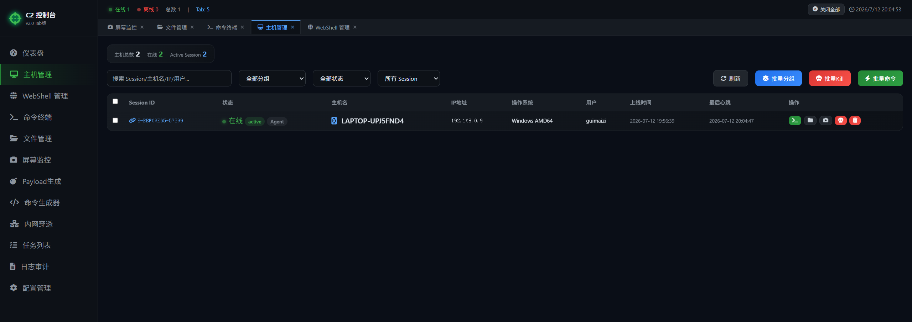
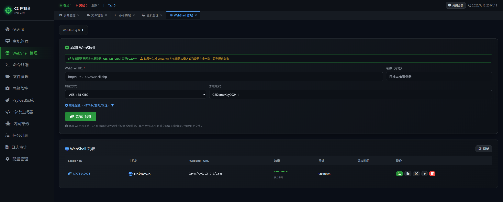
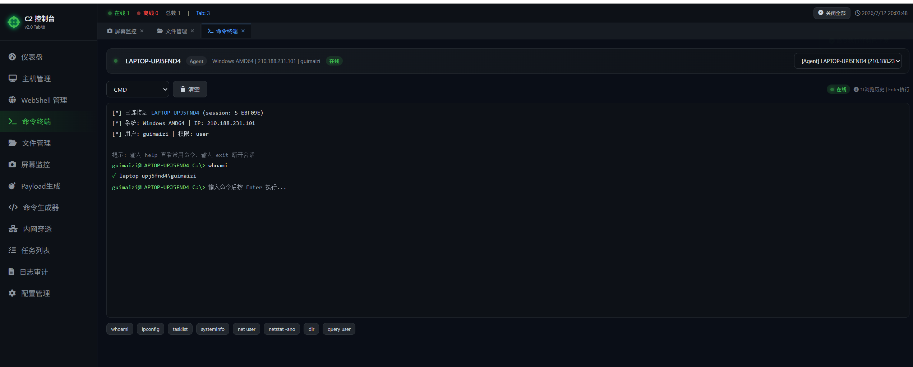
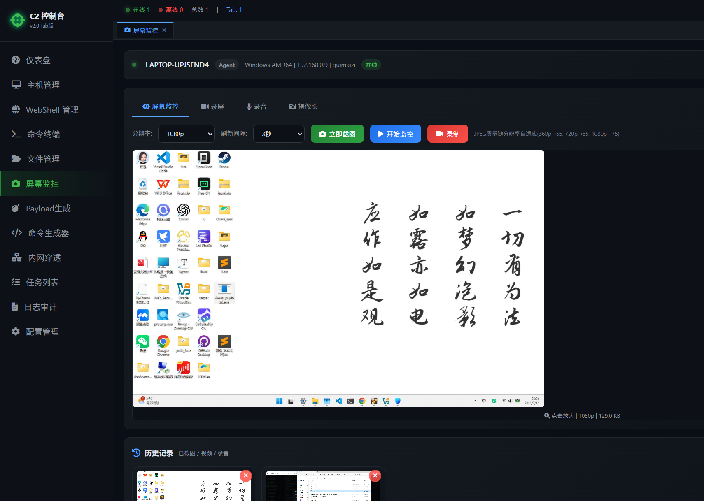
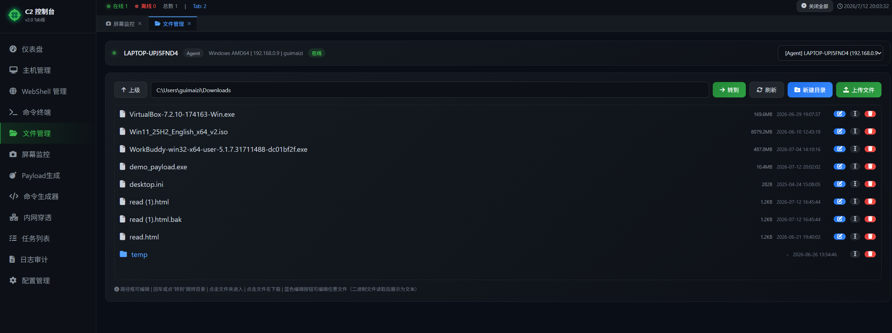
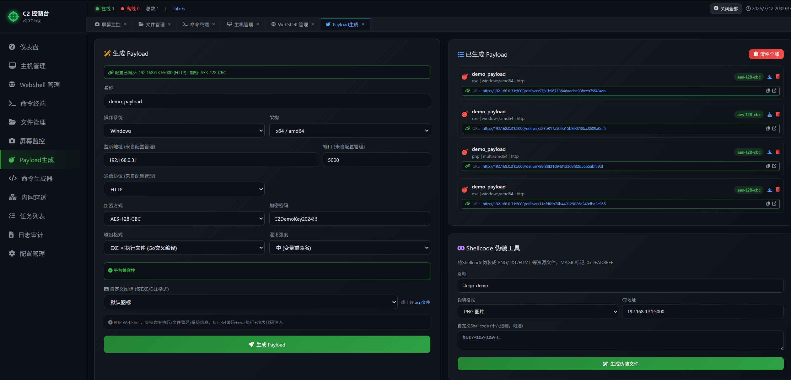
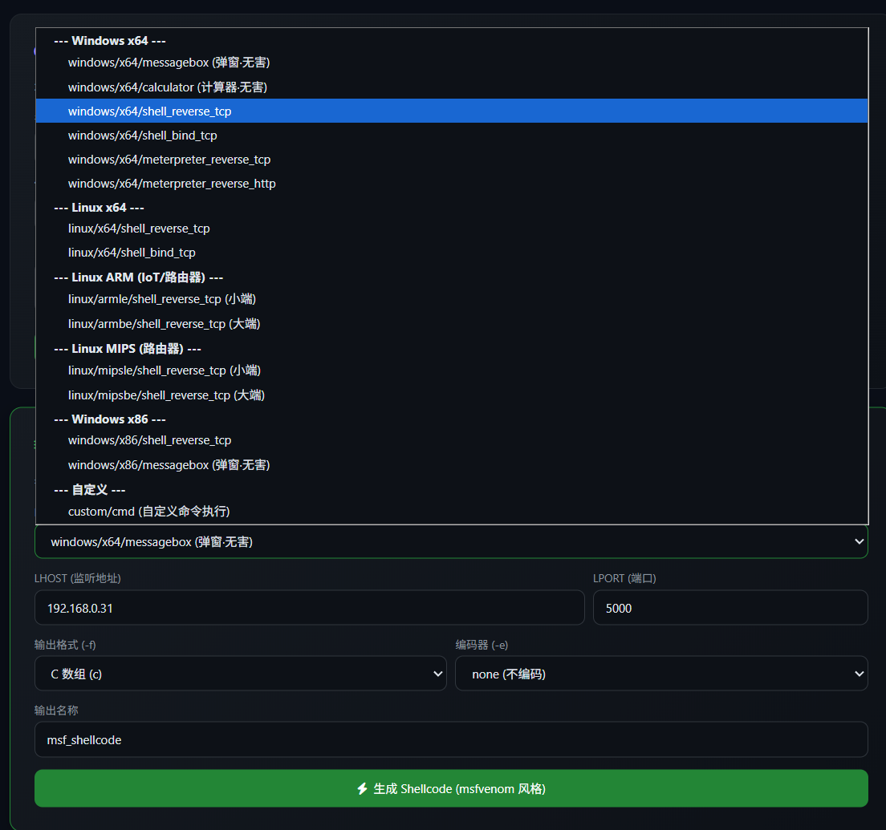
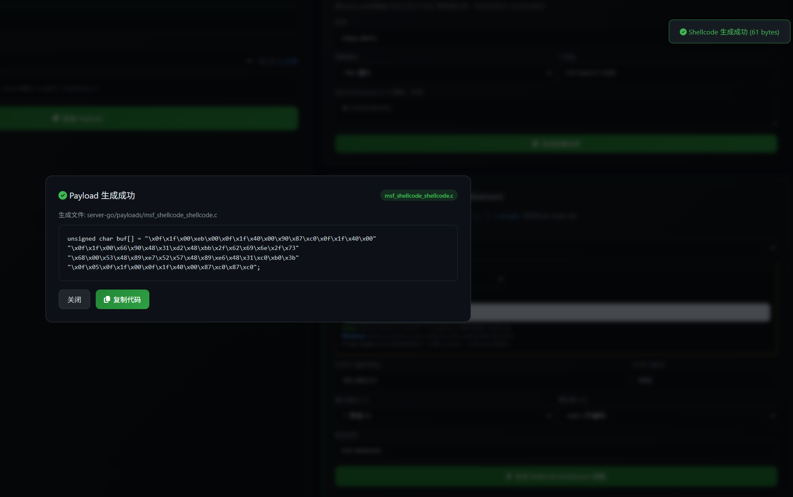
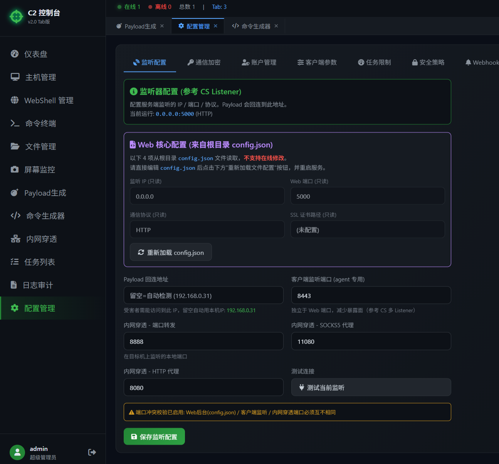
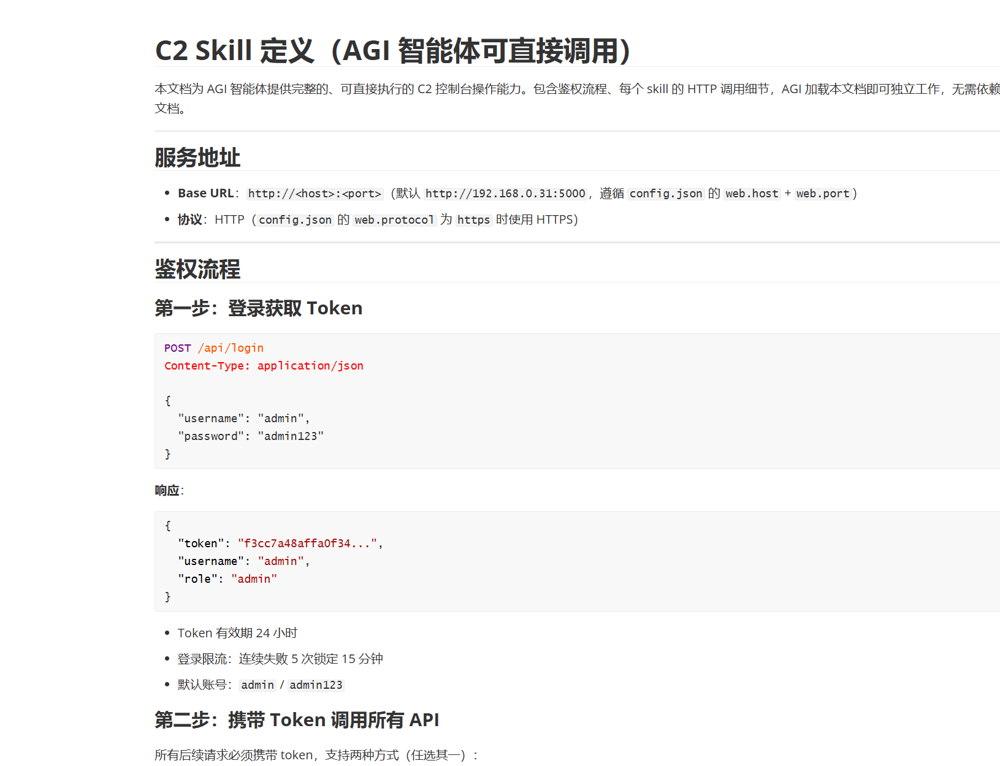

# 功能介绍

vbcoding搞的c2远控，golang开发，类似Metasploit Framework或Cobalt Strike，还有webshell功能，木马生成代码加密混淆，通信加密，支持shellcode... 

Windows/linux/web脚本/arm都支持

https://github.com/guimaizi/c2-rich

具体功能: 

1. 主机管理
2. webshell管理
3. 命令终端
4. 文件管理
5. 屏幕监控
6. payload生成
7. 命令生成器
8. 内网穿透
9. 任务列表
10. 日志审计
11. 配置管理

该有的功能都有，可能还有些bug，自己vibecoding吧，当然，喊我是有偿的。

生成的exe，强混淆有一定的免杀能力，具体没尝试，shellcode也是如此，会有随机值进行混淆下。

多种流量加密可选、三种通信方式可选，什么http、tcp、websocket、aes、rc4、base64。

重要的，支持skill，反正后端都是api，鉴权结束后，你丢agent就可以调用。

